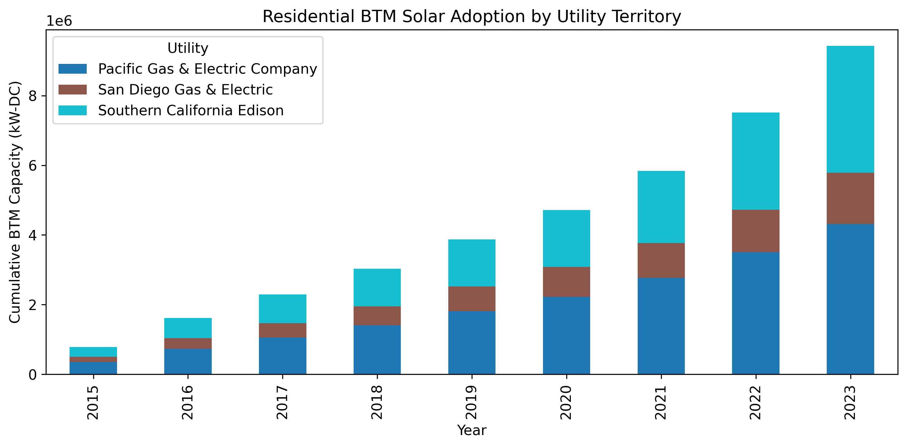
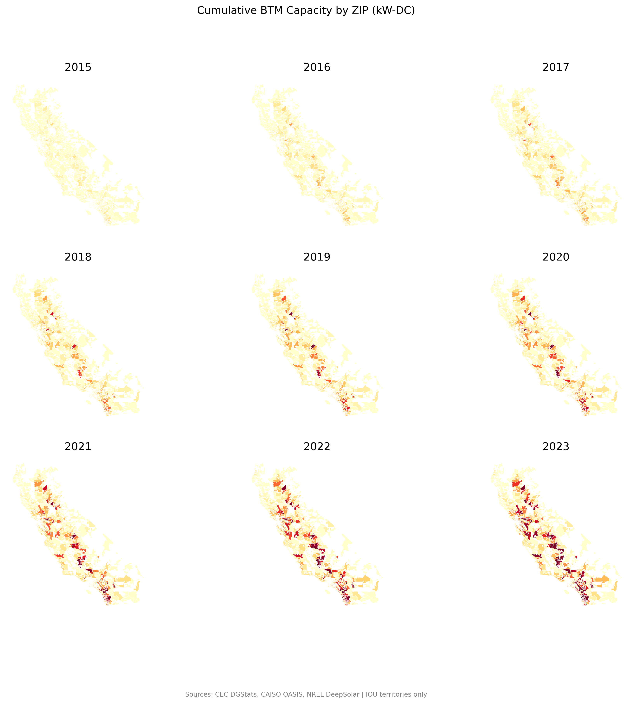
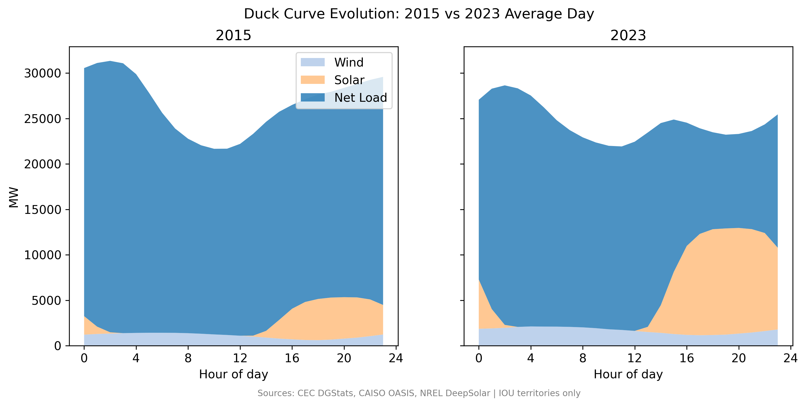
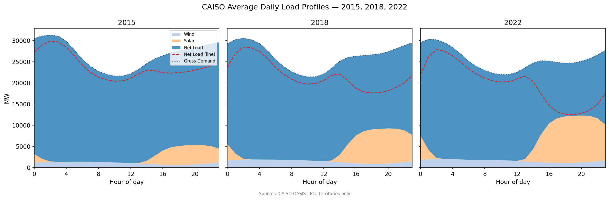
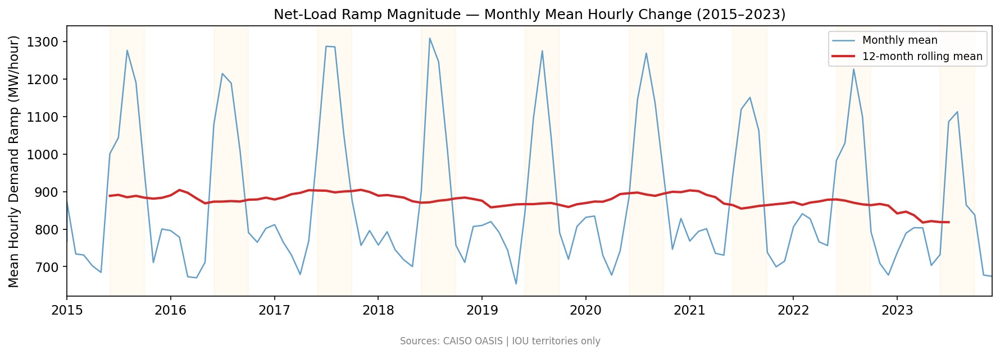
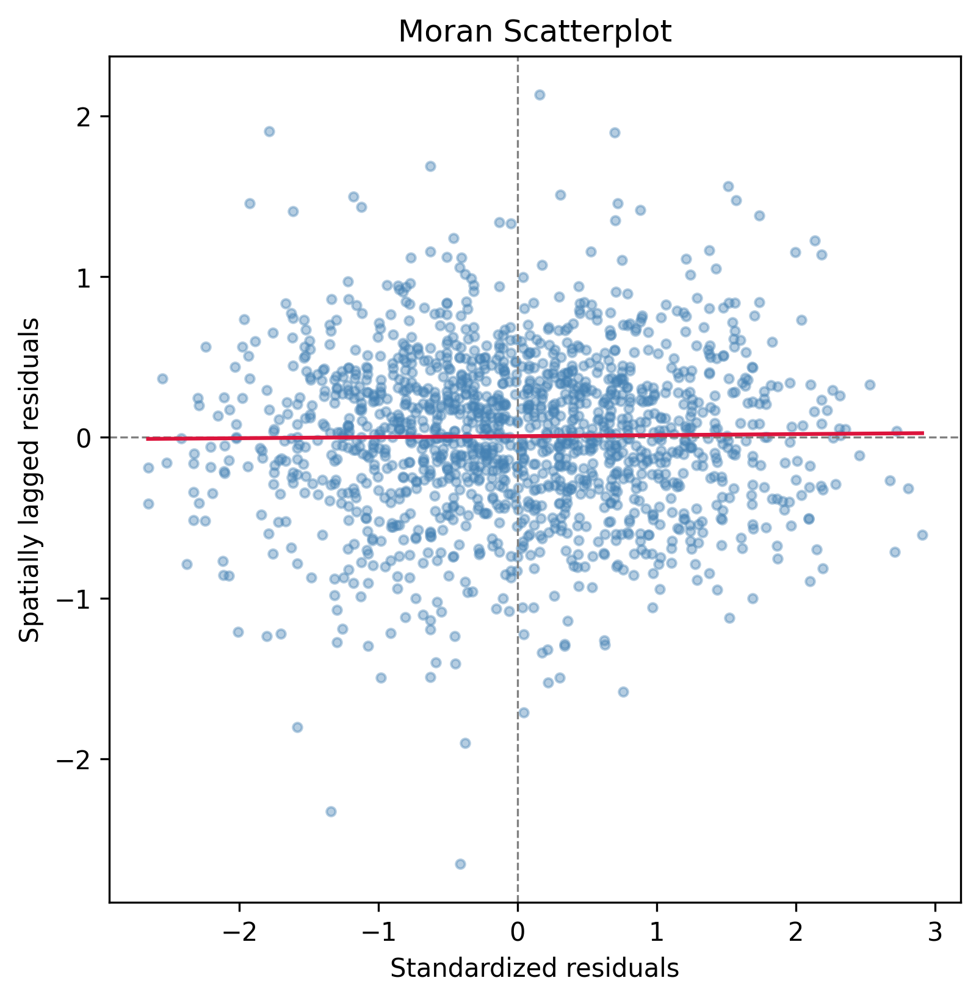

# California Solar Adoption & Grid Evolution (2015–2023)

A data-driven analysis of 1.8M+ solar installations and 9 years of CAISO grid operations.

**Key finding:** BTM adoption clustering is visible and policy-responsive, but system-level grid stress is not driven by geographic concentration—it's a system-wide phenomenon driven by aggregate capacity.

---

## Visual Summary

::::{grid} 2
:::{grid-item-card} Adoption Trajectory

:::
:::{grid-item-card} Density Heatmap

:::
:::{grid-item-card} Duck Curve Evolution

:::
:::{grid-item-card} Hourly Load Profiles

:::
:::{grid-item-card} Grid Stress — Ramp Magnitude

:::
:::{grid-item-card} Spatial Diagnostics

:::
::::

---

Read the full analysis →

```{tableofcontents}
```
